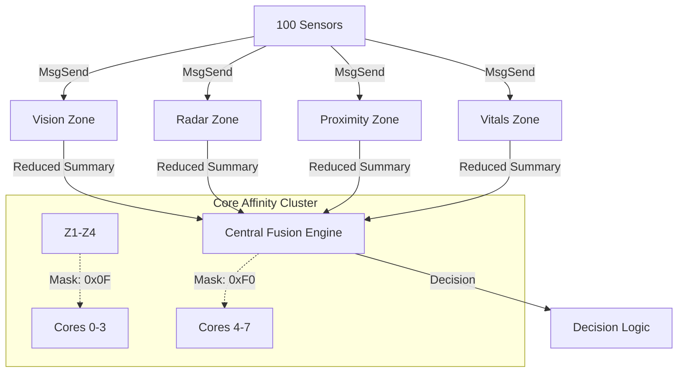

# Q-eHack 2026: Deterministic 100-Sensor ADAS Aggregator
## High-Fidelity Zonal Orchestration on QNX RTOS

[](https://blackberry.qnx.com/)
[]()
[]()

---

## 1. Executive Summary
This project implements a deterministic ADAS sensor aggregation system on the QNX 7.1 Microkernel. By leveraging a **Zonal Architecture** and **8-Core Thread Affinity**, we manage high-bandwidth data streams from **100 concurrent sensors** with nanosecond-level determinism. This report documents the system's evolution from a single-core stress test to a full-scale zonal fusion platform.

---

## 2. System Evolution Lifecycle

### Phase 1: v1.0 — Computational Stress Test
Focus: Establishing baseline scheduling performance and context-switching stability.

| CPU Activity | CPU Usage | CPU Migration |
| :---: | :---: | :---: |
|  |  |  |
| *Distribution under heavy load* | *Stable continuous utilization* | *Migration due to lack of affinity* |

| Inter-CPU Communication | Summary | Timeline |
| :---: | :---: | :---: |
|  |  |  |
| *Initial thread communication* | *Performance overview* | *Timing consistency* |

---

### Phase 2: v2.0 — Multicore Transition
Focus: Moving from centralized to partitioned execution with affinity control.

| CPU Activity | CPU Usage | CPU Migration |
| :---: | :---: | :---: |
|  |  |  |
| *Improved core balance* | *Optimized thread placement* | *Reduced migration jitter* |

| Inter-CPU Communication | Summary | Timeline |
| :---: | :---: | :---: |
|  |  |  |
| *Shared memory synchronization* | *Reduced resource contention* | *Predictable execution flow* |

---

### Phase 3: v3.0 — Systemic IPC Integration
Focus: Decoupling drivers from fusion logic using QNX synchronous message passing.

| CPU Activity | CPU Usage | Inter-CPU Communication |
| :---: | :---: | :---: |
|  |  |  |
| *MsgSend/MsgReceive loops* | *Low-overhead IPC* | *Deterministic service discovery* |

| Summary | Timeline |
| :---: | :---: |
|  |  |
| *Scalable communication* | *Strict timing guarantees* |

---

### Phase 4: v4.0 — Zonal Scaling (Current)
The final architecture scales to simulate **100 Sensors** categorized into 4 hardware-abstracted zones.

**Zonal Configuration Matrix:**
| Zone | Priority | Core Cluster | Sensor Count | Primary Function |
| :--- | :--- | :--- | :--- | :--- |
| **Vision** | 20 | Cores 0-1 | 12 | Surround/Night/Thermal |
| **Radar** | 20 | Cores 1-2 | 20 | Long-range & Corner Sensing |
| **Proximity** | 20 | Cores 2-3 | 24 | Lidar & Ultrasonic Safety |
| **Vitals** | 20 | Core 3 | 44 | IMU, Wheel Speeds, BMS |

---

## 3. Technical Architecture

### 3.1 8-Core Thread Orchestration
The system leverages hardware partitioning to ensure safety-critical tasks are never starved of cycles.



---

## 4. Benchmark Analysis

We benchmarked the system under peak load (100 sensors at 1kHz) to validate deterministic response times.

| Bench Summary | CPU Usage | CPU Activity | Timeline |
| :---: | :---: | :---: | :---: |
|  |  |  |  |
| *Cumulative comparison* | *Deterministic headroom* | *Locked affinity behavior* | *Nanosecond jitter control* |

---

## 5. Fault Tolerance & Safety

The system implements a **Pulse-based Watchdog** pattern for failure detection. If a zone fails significantly, the Central Fusion engine triggers an immediate failover.

> [!IMPORTANT]
> **Safety Guarantee**: QNX's `SCHED_FIFO` scheduler ensures that high-priority radar interrupts (Priority 22) always preempt background simulation tasks (Priority 15).

---

## 6. Build and Deployment

```bash
# Compile for QNX Neutrino Target
make -C src/v4_scaling all

# Run the 8-Core Orchestrator
./src/v4_scaling/system/orchestrator_8core
```

---

## 💡 Final Insight
> "ADAS performance depends not just on algorithms, but on deterministic execution, timing, and synchronization."

QNX enables this through its microkernel isolation, priority inheritance, and message-driven communication.

---
**Q-eHack 2026 Submission**
*Innovation | Performance | Safety*
