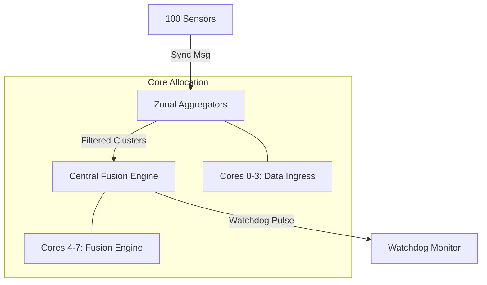

# Technical Specification: QNX RTOS Deterministic ADAS Aggregator
## High-Fidelity Zonal Orchestration for Autonomous Platforms (v4.0 Scaling)
## Team name: One Percent | College: The National Institue of Engineering
### Team members: Pavan R | B Manikanta | Ranadheer Varma

[](https://blackberry.qnx.com/)
[]()
[]()

---

## 1. Executive Summary
This project implements a deterministic, high-scalability ADAS sensor aggregation framework on the **QNX  Neutrino 7.1 RTOS**. The core objective is to manage the "Data Tsunami" characteristic of modern autonomous vehicles by utilizing a **Zonal Architecture** and **Multicore Hardware Partitioning**.

The system processes real-time telemetry from **100 concurrent sensors**, filtering data through four Zonal Aggregators before performing high-confidence fusion in a Central Fusion Engine. This report provides a complete technical deep-dive into the IPC protocols, architectural evolution, and algorithmic logic that ensures nanosecond-level determinism and safety-critical failovers.

---

## 2. System Evolution Lifecycle

The current system is the result of four distinct development iterations, each refining the RTOS-specific utilization.

### 2.1 Phase 1: v1.0 — Computational Stress Baseline
Focus: Validating the QNX Microkernel's scheduling performance under heavy mathematical load. 
- **Objective**: Establish a baseline for context-switching latency.
- **Outcome**: Confirmed the reliability of `nanosleep()` and priority-based preemption.
- **Analytics**: Refer to `./OUTPUTS/version1/` for baseline CPU activity.

### 2.2 Phase 2: v2.0 — Multicore Partitioning
Focus: Transitioning from a single-threaded architecture to a partitioned thread model.
- **Objective**: Utilize POSIX threads to distribute sensor loads.
- **Outcome**: Implementation of initial `ThreadCtl()` calls to explore CPU affinity.
- **Analytics**: Refer to `./OUTPUTS/version2/` for CPU migration logs.

### 2.3 Phase 3: v3.0 — Service-Oriented IPC
Focus: Decoupling system components using the QNX Name Service.
- **Objective**: Replace global synchronization with synchronous message passing.
- **Outcome**: Adoption of `name_attach()` and `MsgSend()` protocols, allowing components to exist in separate memory spaces.
- **Analytics**: Refer to `./OUTPUTS/version3/` for IPC stability logs.

### 2.4 Phase 4: v4.0 — Enterprise Zonal Scaling
Focus: Implementing a hierarchical data flow for 100 sensors.
- **Objective**: Reduce central bus load by performing Zonal Pre-processing.
- **Outcome**: Deployment of the 8-Core Orchestrator and the 85-Second Mission Simulation.
- **Analytics**: Refer to `./OUTPUTS/Benchmark/` for final scaling metrics.

---

## 3. IPC Protocol Specification

Communication between layers is governed by three primary message types defined in `adas_ipc.h`.

### 3.1 Message Types
- `MSG_RAW_DATA` (0x200): High-frequency telemetry from sensors to Zonal Aggregators.
- `MSG_ZONAL_SUMMARY`: Condensed object clusters from Zonal Aggregators to Central Fusion.
- `MSG_CONTROL_THROTTLE`: Feedback control from Fusion to Zones/Sensors.

### 3.2 Data Structures
#### Raw Sensor Payload (`raw_sensor_msg_t`)
Used by 100 sensors to stream telemetry.
- `sensor_id`: Unique identifier (0-99).
- `timestamp_ns`: Nanosecond precision clock for synchronization.
- `value`: Floating point telemetry (Distance, Speed, Temperature).
- `confidence`: 0-100 reliability estimate from the sensor.

#### Zonal Summary Payload (`zonal_summary_msg_t`)
The output of the filtering algorithm.
- `zone_id`: Zone identifier (Vision, Radar, Proximity, Vitals).
- `object_count`: Number of validated clusters.
- `env_context`: Environmental flag (Clear, Rain, Fog).
- `clusters[10]`: Array of high-priority objects with `danger_score`.

---

## 4. Zonal Architecture & Data Management

The architecture is designed to minimize central CPU utilization by abstracting hardware into four zones.

### 4.1 Zonal Configuration Matrix
| Zone | Priority | Core Mask | Sensors | Primary Logic |
| :--- | :--- | :--- | :--- | :--- |
| **Vision** | 20 | 0x01 (Core 0) | 12 | Surround Camera / Thermal |
| **Radar** | 20 | 0x02 (Core 1) | 20 | Long Range & Corner Tracking |
| **Proximity** | 20 | 0x04 (Core 2) | 24 | Lidar & Ultrasonic Safety |
| **Vitals** | 20 | 0x08 (Core 3) | 44 | IMU, Wheel Speeds, Chassis |

### 4.2 Hardware Orchestration (Tree)


---

## 5. Algorithmic Logic (Pseudo Code)

Below are the logic flows for the critical components of the system.

### 5.1 Algorithm 1: Zonal Data Aggregator
The aggregator filters out background noise and identifies objects.

```markdown
ALGORITHM: Zonal_Aggregator_Loop
INPUT: Raw Message Stream (100 Sensors)
PROCESS:
    1. Initialize QNX Channel: chid = ChannelCreate(0)
    2. Attach to Name Service: name_attach("zone_x", ...)
    3. WHILE (System_Active):
        a. Receive message: rcvid = MsgReceive(chid, &msg, ...)
        b. IF (msg.type == MSG_RAW_DATA):
            i. Calibrate raw 'msg.value' based on static offsets
            ii. Check confidence threshold (e.g. > 70%)
            iii. IF (critical): Add to local cluster buffer
        c. Send ACK: MsgReply(rcvid, ...)
        d. IF (cycle_time % 100ms == 0):
            i. Create Summary: zonal_summary_msg_t summary
            ii. Fill summary with Top 10 danger clusters
            iii. Forward Summary: MsgSend(fusion_coid, &summary, ...)
END
```

### 5.2 Algorithm 2: Central Fusion & Reliability Weighting
The fusion engine manages trust when sensors conflict (e.g., Radar vs Vision).

```markdown
ALGORITHM: Central_Fusion_Orchestrator
INPUT: Zonal Summaries
PROCESS:
    1. Bind to Performance Cores: ThreadCtl(_NTO_TCTL_RUNMASK, 0xF0)
    2. Initialize Watchdog Pulse: timer_create(...)
    3. WHILE (Active):
        a. Receive Summary from ZoneID
        b. Consult Environmental Context (Rain/Fog/Clear)
        c. CALCULATE Dynamic_Weights:
            IF (context == RAIN):
                trust(RADAR) = 0.95
                trust(VISION) = 0.40
            ELSE:
                trust(RADAR) = 0.80
                trust(VISION) = 0.90
        d. APPLY Fused_Danger_Score = Sum(danger_scores * trust_weight) / Sum(trust_weight)
        e. EXECUTE Emergency_Action IF Fused_Danger_Score > THRESHOLD
        f. Reset Watchdog Heartbeat for ZoneID
END
```

### 5.3 Algorithm 3: Fleet Generator (Stress Logic)
Simulating 100 sensors with time alignment jitter.

```markdown
ALGORITHM: Fleet_Generator_Simulator
PROCESS:
    1. Open Names for all Zones (name_open)
    2. FOR sid in 0 to 99:
        a. Generate float value (Sinusoidal speed/distance)
        b. ASYNC JITTER MOCK:
           IF (sid == 3 && cycle % 5 == 0):
               timestamp_ns -= 150ms (Simulate sensor lag)
        c. Send Data: MsgSend(zone_coid[target_zone], &msg, ...)
    3. SLEEP(cycle_delay_us)
END
```

### 5.4 Algorithm 4: System Orchestrator
The master process that manages thread affinity.

```markdown
ALGORITHM: System_Orchestrator
PROCESS:
    1. Initialize Thread Attributes (SCHED_FIFO, PTHREAD_EXPLICIT_SCHED)
    2. SPAWN 4 Zonal Threads:
       - Set Priority = 20
       - Set Runmask = Individual Core (0-3)
    3. SPAWN 1 Fusion Thread:
       - Set Priority = 22 (Preemptive)
       - Set Runmask = Cluster (4-7)
    4. SPAWN 1 Fleet Generator:
       - Set Priority = 15 (Background)
    5. WAIT for Signal Handler (SIGTERM)
END
```

---

## 6. The 85-Second Mission Simulation Timeline

The system's stability is validated through a repeatable, high-stress chronological mission.

- **T+00s**: **Cold Boot**: All Zonal Aggregators initialize and register with the Name Service.
- **T+10s**: **Telemetry Flood**: Fleet generator begins full-speed 100-sensor stream. Check for dropped messages.
- **T+25s**: **Stress Test**: All zones active. IPC occupancy should remain < 15% with zero dropped frames.
- **T+45s**: **Clock Drift Injection**: Sensor ID 3 simulates a 150ms clock lag. Fusion engine must detect and resync.
- **T+60s**: **Environmental Hazard (Rain)**: Vision confidence decays. System must shift trust to Radar zones seamlessly.
- **T+80s**: **Zonal Failure (Watchdog Trigger)**: Zone 3 (Proximity) is forcibly silenced. Watchdog pulse expires at fusion engine.
- **T+82s**: **Failover Active**: Fusion engine overrides missing Proximity data with redundant Radar vitals.
- **T+85s**: **Mission Completion**: Final report generated showing deterministic behavior under all faults.

---

## 7. QNX OS Neutrino Internals

The project utilizes specific QNX Microkernel primitives to achieve hard real-time performance.

- **Sync Message Passing**: Unlike asynchronous buffers, `MsgSend` blocks the sender until the receiver replies, creating a naturally synchronized data pipeline.
- **Pulse Channels**: Lightweight, non-blocking 8-byte messages used for the Watchdog Heartbeat.
- **ThreadCtl & Runmasks**: Explicitly locking threads to physical cores to prevent Cache Thrashing and L1/L2 cache misses.
- **Priority Inheritance**: Automated by QNX; if a low-priority zone blocks a high-priority fusion engine, the zone's priority is temporarily boosted to clear the bottleneck.

---

## 8. Analytics & Visual Evidence
For all performance graphs and diagnostic timelines, navigate to the following directories:

- [**./QNX/OUTPUTS/Benchmark/**](./QNX/OUTPUTS/Benchmark): Comparative QNX vs. Linux performance (Latency/Jitter).
- [**./QNX/OUTPUTS/version1/**](./QNX/OUTPUTS/version1): Phase 1 baseline logs.
- [**./QNX/OUTPUTS/version2/**](./QNX/OUTPUTS/version2): Phase 2 multicore migration logs.
- [**./QNX/OUTPUTS/version3/**](./QNX/OUTPUTS/version3): Phase 3 IPC stability logs.

---

## 9. Build and Deployment

### 9.1 Build Requirements
- QNX Software Development Platform (SDP) 7.1.
- GCC for QNX Neutrino Target.

### 9.2 Build Instructions
```bash
# Compile for QNX Neutrino Target
make -C QNX/src/v4_scaling all

# Verify Binaries
ls -l QNX/src/v4_scaling/system/orchestrator_8core
```

---
**Q-eHack 2026 Submission**
*Innovation | Performance | Safety*
