#Q-eHack 2026: Deterministic 100-Sensor ADAS Aggregator#
**High-Fidelity Zonal Orchestration on QNX RTOS**

# Q-eHack 2026: Deterministic 100-Sensor ADAS Aggregator  
High-Fidelity Zonal Orchestration on QNX RTOS

---

## 1. Executive Summary

This project implements a deterministic ADAS sensor aggregation system on QNX RTOS with focus on real-time scheduling, IPC, and multi-core execution.

---

## Phase 1: v1.0 — Computational Stress Test

### CPU Activity
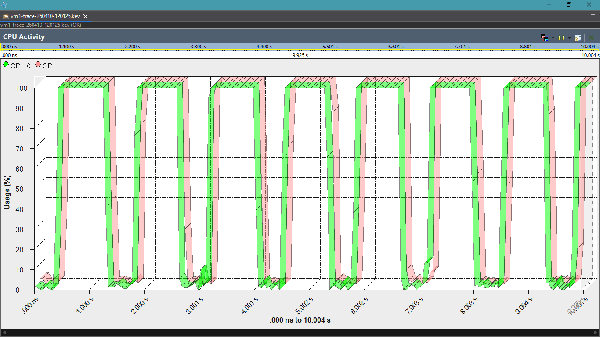

Shows how CPU behaves under heavy computation.

---

### CPU Usage
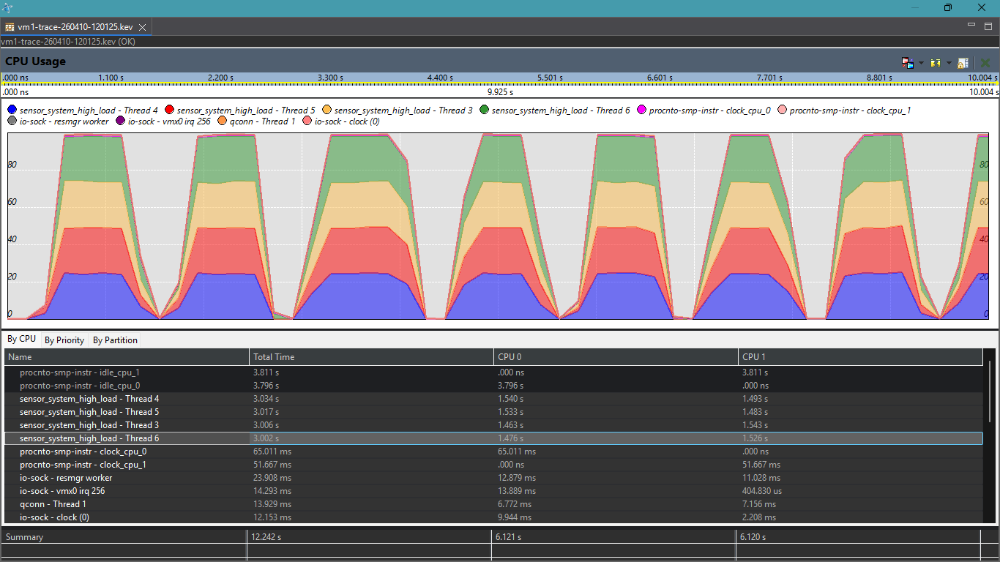

Stable usage under load.

---

### CPU Migration
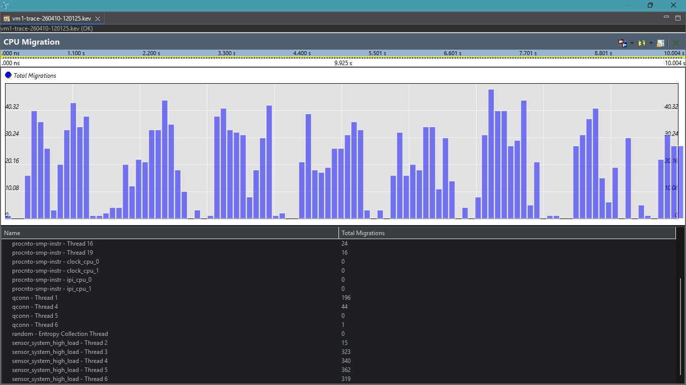

Thread movement across cores due to no affinity.

---

### Inter-CPU Communication

Basic communication pattern.

---

### Summary
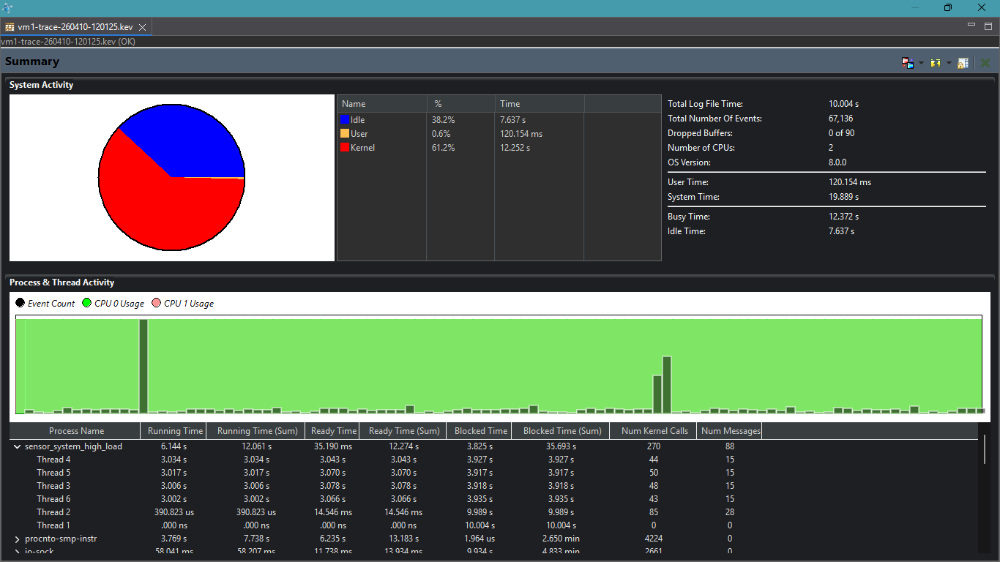

Overall performance.

---

### Timeline
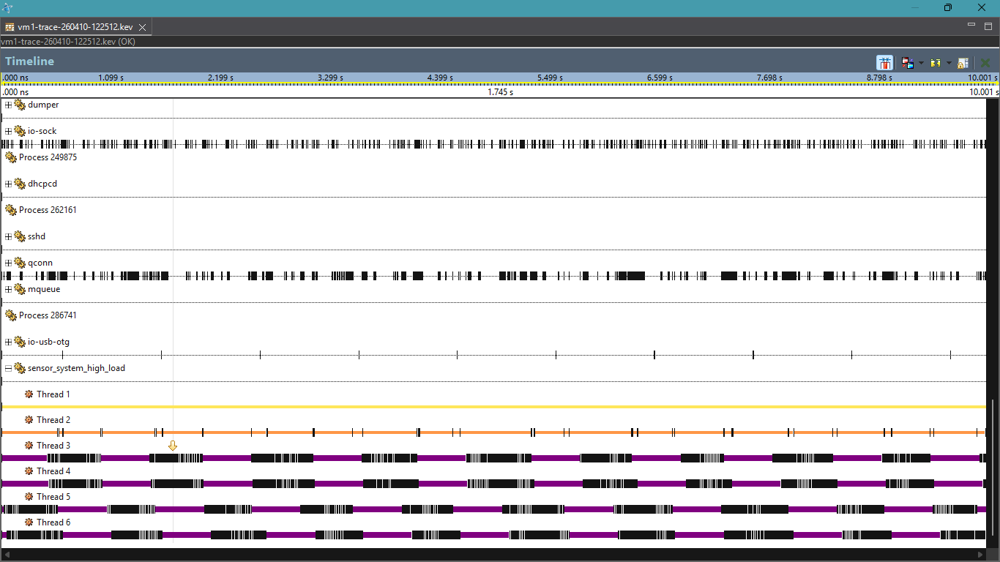

Execution consistency.

---

## Phase 2: v2.0 — Multicore Transition

### CPU Activity
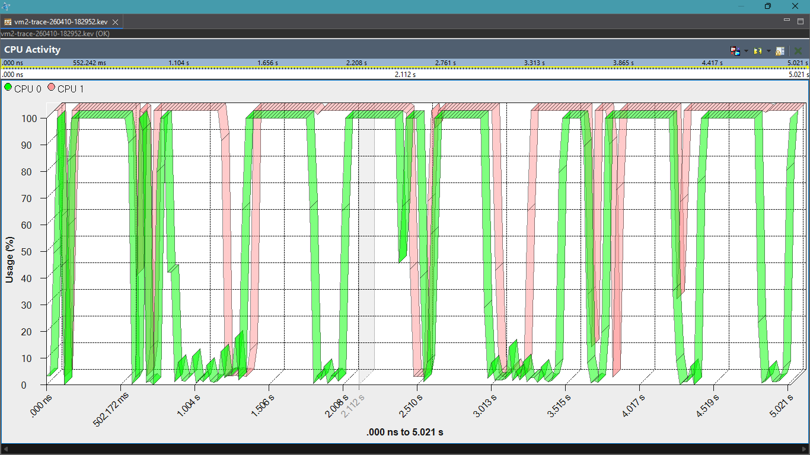

Better core distribution.

---

### CPU Usage
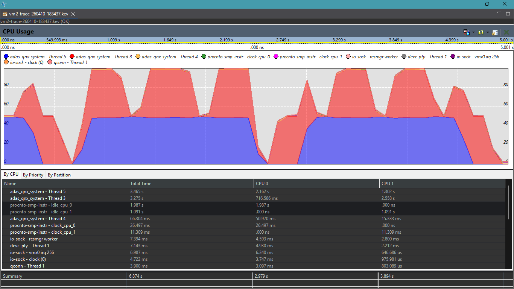

Improved balance.

---

### CPU Migration
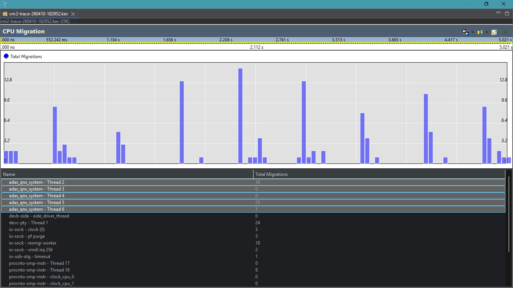

Reduced migration.

---

### Inter-CPU Communication

Shared memory communication.

---

### Summary
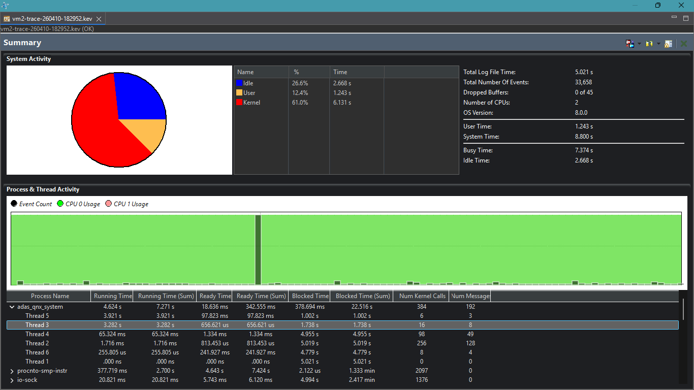

Improved efficiency.

---

### Timeline
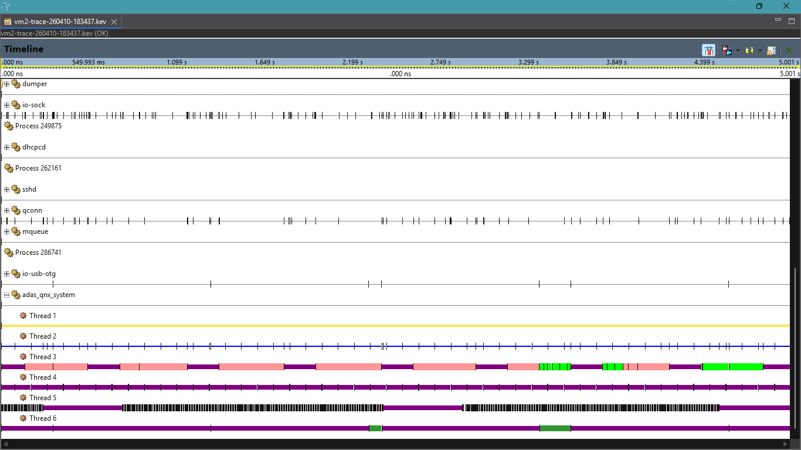

More predictable execution.

---

## Phase 3: v3.0 — IPC Integration

### CPU Activity
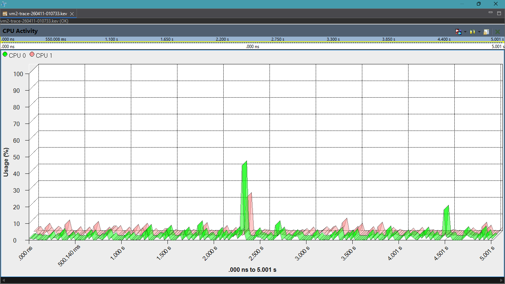

Stable scheduling.

---

### CPU Usage
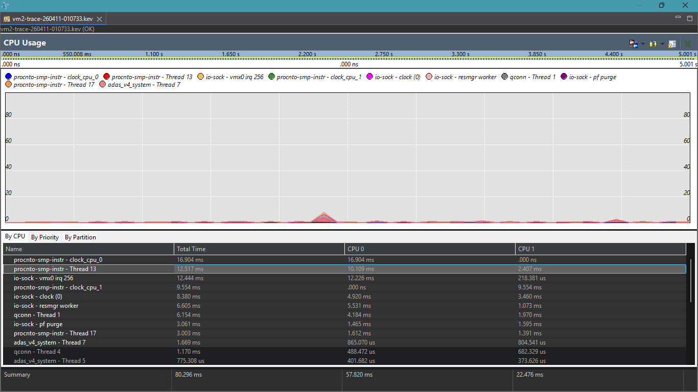

Efficient utilization.

---

### Inter-CPU Communication
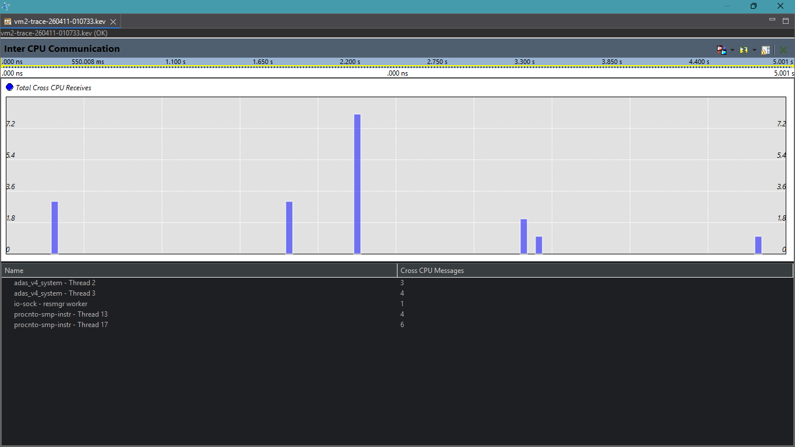

Deterministic message passing.

---

### Summary
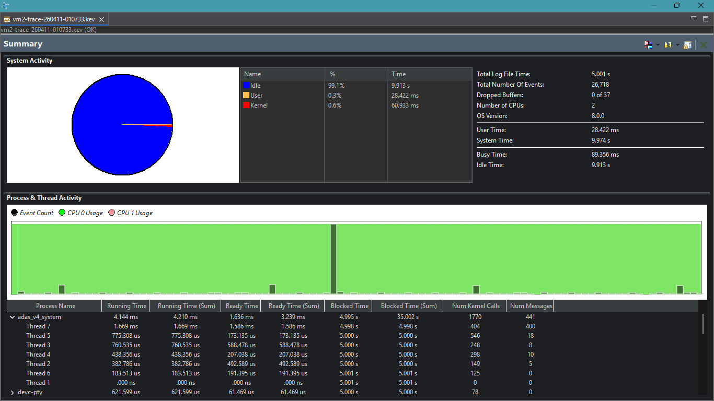

Stable IPC performance.

---

### Timeline
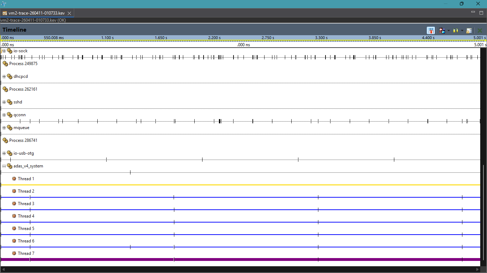

Deterministic execution.

---

## Phase 4: v4.0 — Zonal Scaling

100 sensors distributed across zones:
- Vision
- Radar
- Proximity
- Vitals

Zonal processing reduces IPC load and improves scalability.

---

## Benchmark Analysis

### Summary

Overall performance.

---

### CPU Usage

Consistent usage.

---

### CPU Activity

Deterministic scheduling.

---

### Timeline

Low jitter execution.

---

## Final Insight

> ADAS performance depends on deterministic execution, not just algorithms.

---

Q-eHack 2026 Submission
