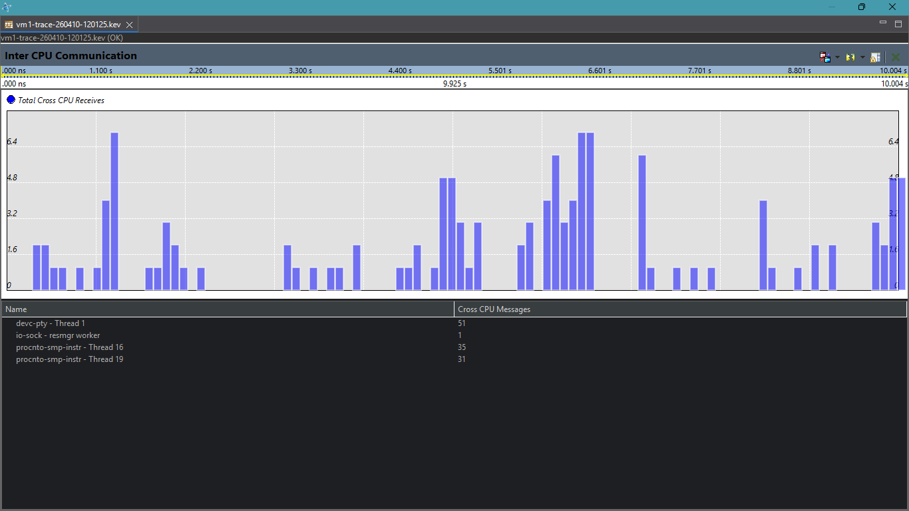
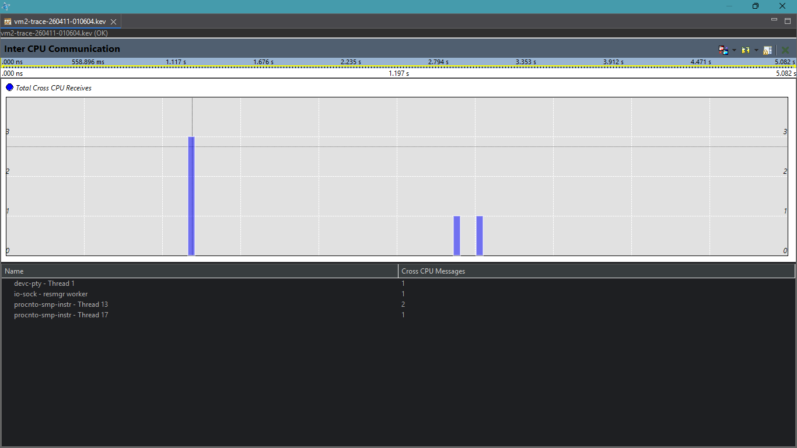
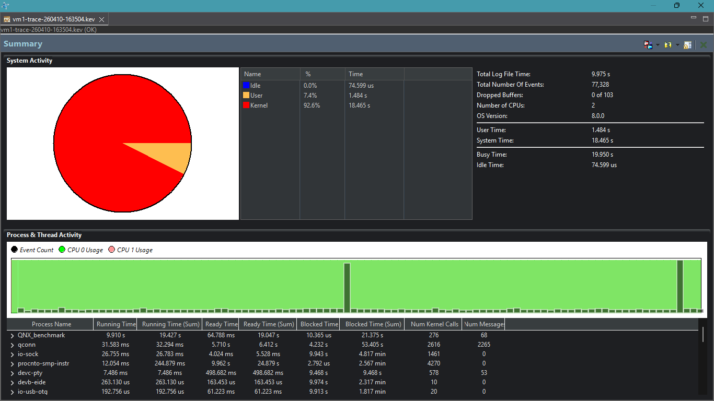
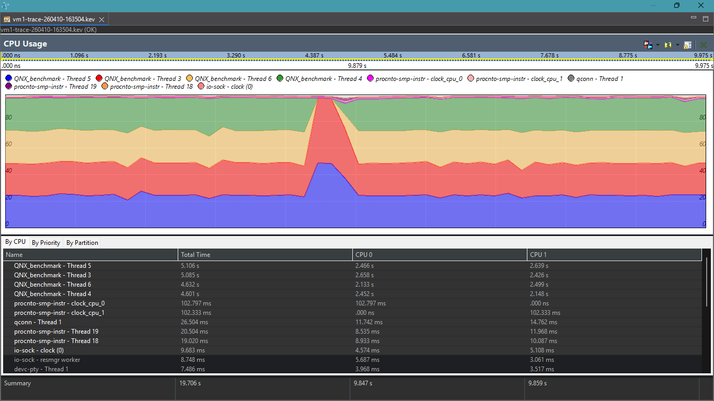
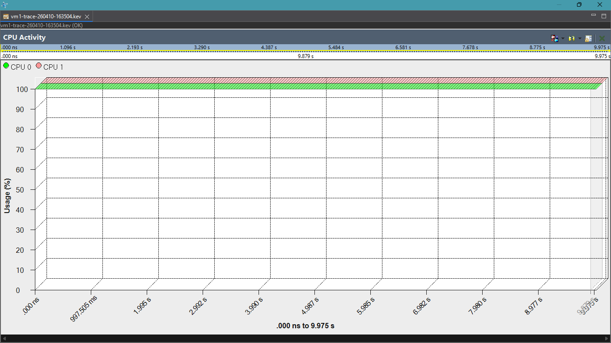
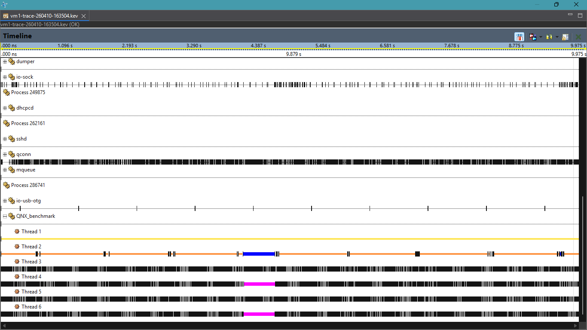

#Q-eHack 2026: Deterministic 100-Sensor ADAS Aggregator#
**High-Fidelity Zonal Orchestration on QNX RTOS**

# Q-eHack 2026: Deterministic 100-Sensor ADAS Aggregator  
High-Fidelity Zonal Orchestration on QNX RTOS

---

## 1. Executive Summary

This project implements a deterministic ADAS sensor aggregation system on QNX RTOS.  
The focus is on real-time scheduling, inter-process communication (IPC), and multi-core execution under high sensor load.

---

## Phase 1: v1.0 — Computational Stress Test

### CPU Activity

This shows how CPU cores behave under heavy computation. The scheduler distributes workload efficiently.

---

### CPU Usage

Demonstrates stable CPU usage even under continuous load.

---

### CPU Migration

Threads migrate across cores due to lack of affinity, reducing determinism.

---

### Inter-CPU Communication

Initial communication between threads without structured IPC.

---

### Summary

Overall system performance overview.

---

### Timeline

Execution timing consistency under load.

---

## Phase 2: v2.0 — Multicore Transition

### CPU Activity

Improved workload distribution across multiple cores.

---

### CPU Usage

Better CPU balancing compared to Phase 1.

---

### CPU Migration

Reduced migration due to affinity control.

---

### Inter-CPU Communication

Threads now communicate using shared memory and synchronization.

---

### Summary

Improved performance and reduced contention.

---

### Timeline

More predictable execution.

---

## Phase 3: v3.0 — IPC Integration

### CPU Activity

Stable execution using message passing.

---

### CPU Usage

Efficient CPU utilization.

---

### Inter-CPU Communication

Deterministic communication using QNX IPC.

---

### Summary

Stable IPC performance under load.

---

### Timeline

Highly predictable execution timing.

---

## Phase 4: v4.0 — Zonal Scaling

The system scales to simulate 100 sensors across 4 zones:

- Vision  
- Radar  
- Proximity  
- Vitals  

Each zone aggregates data before sending it to the fusion engine, reducing IPC load and improving efficiency.

---

## Benchmark Analysis

### Summary

Overall system performance comparison.

---

### CPU Usage

Stable CPU usage under high load.

---

### CPU Activity

Deterministic scheduling behavior.

---

### Timeline

Low jitter and consistent execution.

---

## Final Insight

> ADAS performance depends not just on algorithms,  
> but on deterministic execution, timing, and synchronization.

QNX enables this through its microkernel architecture, priority scheduling, and message-driven communication.

---

Q-eHack 2026 Submission
